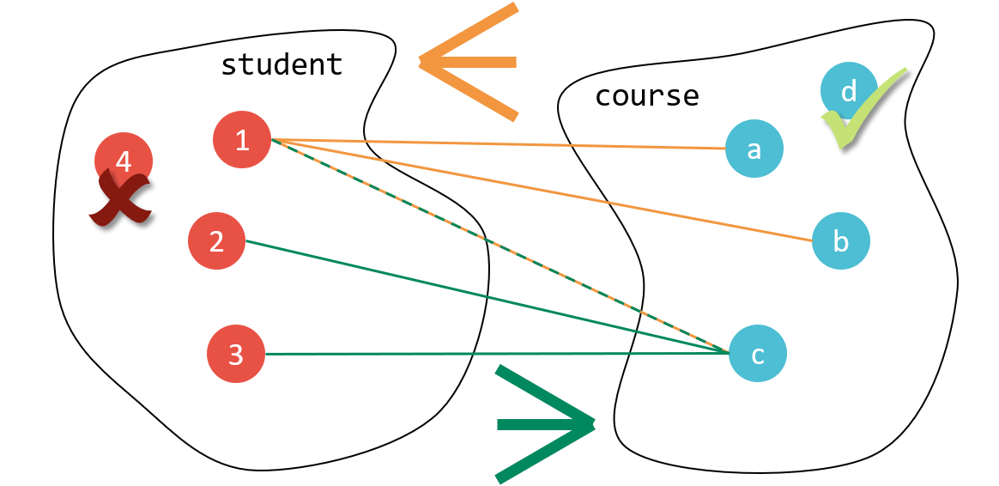

# n:m-Beziehungstyp

Wir haben den 1:n-Beziehungstyp kennengelernt, mit dessen hilfe wir einen großen Teil der Beziehungen modellieren könne, denen wir in der Praxis begegnen - ein Datenobjekt steht mit mehreren Datenobjekten in Beziehung. Allerdings gibt es in der Data Engineering Praxis auch Situationen, wo dieser Beziehungstyp nicht ausreicht. 

Schauen wir uns z.B. die Beziehung zwischen Studierenden und Kursen an einer Universität an, stellen wir fest, dass hier der 1:n-Beziehungstyp nicht in der Lage ist, die natürliche Beziehung dieser beiden Entitätstypen zu beschreiben: Eine Studierende kann mehrere Kurse belegen. Jeder Kurs kann aber von mehreren Studierenden belegt werden. Hier benötigen wir den n:m-Beziehungstyp, um diesen Umstand in einem Datenmodell erfassen zu können.

## Modellierung

Bleiben wir beim oben beschriebenen Beispiel: Eine Studierende kann mehrere Kurse belegen. Jeder Kurs kann aber gleichzeitig von mehreren Studierenden belegt werden. In der Mengendarstellung unterhalb wird dieser Sachverhalt abgebildet.



Hier ist leicht erkennbar, dass z.B. Student_in 1 die Kurse a, b und c belegt. So ergibt sich ein "Krähenfuß" (hier orange abgebildet), der von der linken in die rechte Menge läuft. Gleichzeitig kann erkannt werden, dass z.B. Kurs c von den Student_innen 1, 2 und 3 belegt wird. Deshalb entsteht noch ein zweiter "Krähenfuß" (hier grün dargestellt), der von der rechten in die linke Menge läuft.

In der Mengendarstellung gehen wir außerdem davon aus, dass es keine Studierenden geben kann, die keinen einzigen Kurs belegen. Das würde z.B. auf die dargestellte Student_in 4 zutreffen (weshalb diese mit einem roten X markiert ist). Auf Seite der Kurse gehen wir hingegen davon aus, dass es sehr wohl Kurse geben kann, die bisher von noch keiner Studen_in belegt wurden - z.B. weil sich noch niemand in den Kurs eingeschrieben hat. 

Überführen wir die Informationen, die wir in der Mengendarstellung gewonnen haben in ein allgemeines Modell, so würde sich folgendes Datenmodell ergeben.

```mermaid
%%{init: {'securityLevel': 'loose', 'theme':'base'}}%%

erDiagram
    student {
        integer_PK student_id
        varchar45 firstname
        varchar50 lastname
        varchar1 gender
        varchar80 email
        date birthdate
        varchar2 nationality
        datetime registry_date
        varchar50 program
    }
    course {
        integer_PK course_id
        varchar60 title
    }
    student }o--|{ course : ""
```

Hier fallen sofort die beiden Krähenfüße auf, die wir direkt aus der Mengendarstellung übernehmen konnten. Der untere Krähenfuß verdeutlicht, dass Studierende viele (m) Kurse belegen können. Der horizontale Marker oberhalb vom Krähenfuß verdeutlicht gleichzeitig, dass jede Student_in zumindest einen Kurs belegen muss.

Interpretieren wir den oberen Krähenfuß, stellen wir fest, dass ein Kurs von vielen (n) Studierenden belegt werden kann, jedoch nicht unbedingt von Studierenden belegt sein muss. Letzteres verdeutlicht das Kreissymbol (0) direkt unterhalb vom Krähenfuss.

Mit diesem Wissen kann die Beziehung zwischen Student_in und Kurs als n:m-Beziehung (sprich n-zu-m-Beziehung) bezeichnet werden kann. Damit sind die Kardinalitäten der beiden Beziehungsenden vollständig beschrieben. Die Konditionalitäten sind einmal 1 (auf der rechten Seite) und einmal 0 (auf der linken Seite der Beziehung). Die Beziehung könnte folglich auch als 0n:1m-Beziehung beschreiben werden.

## Implementierung

Beim 1:n-Beziehungstyp hatten wir zur datenbankseitigen Implementierung einen Fremdschlüssel verwendet. Diesen hatten wir auf der n-Seite der Beziehung vorgesehen. Nun bleibt noch die Frage, wie ein n:m-Beziehungstyp datenbankseitig implementiert werden kann. 

Hierzu ist in der Praxis eine zusätzliche Tabelle - oft Auflösungstabelle (im Englischen auch "Link table") genannt - notwendig. Diese Tabelle wird zwischen die beiden Stammtabellen eingebaut. Die Auflösungstabelle stellt dabei einen eigenen Entitätstyp dar und kann auch im Modell wie folgt dargestellt werden.

>**Praxis Tipp:** Während in der Praxis häufig wenig sprechende Namen für Auflösungstabellen gebräuchlich sind (z.B. "student_course_link"), empfehlen wir, Benennungen zu verwenden, die den Modellierungskontext korrekt wiedergeben. Im gegebenen Beispiel beschreibt die Auflösungstabelle etwa die Einschreibung von Studierende in Kurse. Dashalb bietet sich hier der Tabellentitel "Enrollment" an, um diesen Sachverhalt auszudrücken. Das hilft beim Lesen des Modells und erlaubt es den Modellierungskontext beim Lesen besser zu rekonstruieren.

```mermaid
%%{init: {'securityLevel': 'loose', 'theme':'base'}}%%

erDiagram
    student {
        integer_PK student_id
        varchar45 firstname
        varchar50 lastname
        varchar1 gender
        varchar80 email
        date birthdate
        varchar2 nationality
        datetime registry_date
        varchar50 program
    }
    course {
        integer_PK course_id
        varchar50 title
    }
    enrollment {
        integer_PK enrollment_id
        varchar4 semester
    }
    student ||--|{ enrollment : ""
    course ||--o{ enrollment : ""
```

Die ursprünglichen Krähenfüße können bei der Auflösung der n:m-Beziehung direkt übernommen werden. Wie im Beispiel dargestellt, kann der Entitätstyp, der die Auflösungstabelle beschreibt, auch eigene Attribute besitzen. So kann z.B. das Attribut Semester verwendet werden, um Entitäten des Entitätstyps Enrollment genauer zu beschreiben.

>**Praxis Tipp:** Wir empfehlen n:m-Beziehungen stets in ihrer aufgelösten Form im Modell abzubilden. Dadurch kann im Modell explizit beschrieben werden wie (a) die Auflösungstabelle benannt werden und (b) welche zusätzlichen Attribute diese enthalten soll. Alternativ wäre aber auch die verdichtete Darstellung möglich.

Unterhalb beginnen wir mit er datenbankseitige Umsetzung des oben dargestellten Modells. Dazu erzeugen wir die Datenbank und erstellen die beiden Tabellen `student` und `course`. 

``` sql
drop database if exists university;
create database if not exists university;
use university;

drop table if exists student;
create table if not exists student (
    student_id int auto_increment primary key,
    firstname varchar(45),
    lastname varchar(50),
    gender varchar(1),
    email varchar(80),
    birthdate date,
    nationality varchar(2),
    registry_date datetime
);

drop table if exists course;
create table if not exists course (
	course_id int auto_increment primary key,
    title varchar(60)
);
```

Zuletzt erzeugen wir noch die Auflösungstabelle `enrollment`. Hier setzten wir die beiden Fremdschlüsselattribute um, auf die uns die Krähenfüße im Modell schon hinweisen. Außerdem erhält die Tabelle noch einen eigenen Primärschlüssel (`enrollment_id`) und das `semester` Attribut.

```sql hl_lines="5 6 7 9 10 11"
drop table if exists enrollment;
create table if not exists enrollment (
	enrollment_id int auto_increment primary key,

    student_id int,
    foreign key (student_id)
    references student (student_id),

    course_id int,
    foreign key (course_id)
    references course (course_id),

    semester varchar(4)
);
```

Das vollständige Beispiel (inklusive Beispieldaten) könnt ihr euch 📁 [hier herunterladen](../downloads/student_program_course.sql).
