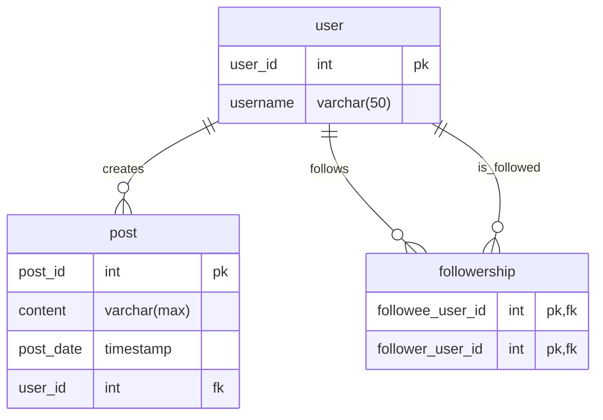
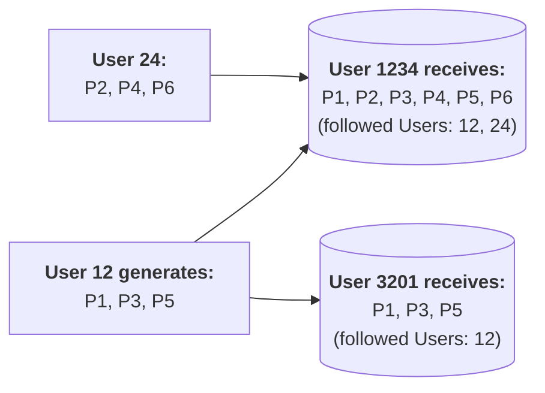

# Passendes Datenbanksystem auswählen

Als Data Engineer steht man häufig vor der Entscheidung, welches Datenbanksystem denn nun das richtige für den jeweiligen Use Case sei. Vertraut man auf eine klassische relationale Datenbanksystem, wie z. B. MariaDB, oder entscheidet man sich doch für eine der vielen aufstrebenden Alternativen? Wo liegen die Stärken und Schwächen der einzelnen Systemtypen? In diesem Kapitel möchte ich mich mit diesen Fragen beschäftigen. Wir gehen dazu von einem einfachen Beispiel aus, das ich zunächst beschreiben werde. Anschließend werden wir uns mit den einzelnen Systemtypen beschäftigen und deren Vor- und Nachteile herausarbeiten.

## Die Herausforderung wachsen zu können

Viele der heute populärsten Webapplikationen der Welt bauen auf einem simplen Datenmodell auf. Betrachten wir etwa soziale Medien, wie z.B. Instagram, sehen wir, dass deren Kernfunktionalität - das Verfolgen von anderen Personen und das Verfassen von Posts - mit nur wenigen Tabellen in einem relationalen Datenbanksystem abbgebildet werden kann.



Posts können im System gespeichert werden, indem ein neuer Datensatz in der `post`-Tabelle angelegt wird. Die Verbindung zum erfassenden Nutzer wird über den Fremdschlüssel `user_id` in der `post`-Relation hergestellt. 

Wenn ein beliebiger Nutzer (z. B. der/die Nutzer:in mit der Identifikationsnummer 1234) jene Posts abfragen will, die von anderen Nutzer:innen verfasst wurden, denen er/sie folgt, kann das im vorliegenden, relationalen Datenmodell einfach abgebildet werden. Dazu werden in der Datenbank die Tabellen `post` und `followership` gemeinsam abgefragt. Das könnte z. B. wie unterhalb dargestellt erfolgen.

```sql
select p.content
from followership as f
join post as p on p.user_id = f.followee_user_id
where f.follower_user_id = 1234;
```

Um diese Abfrage zu bedienen, erstellt die Datenbank ein Kreuzprodukt der Inhalte der Tabellen `followership` und `post`. Hierbei wird jeder Datensatz der Tabelle `followership` mit jedem Datensatz der Tabelle `post` kombiniert. Je größer beide Tabellen sind, umso größer ist die Ergebnismenge dieser Operation und desto aufwendiger wird diese für das Datenbanksystem und desto länger muss die Nutzer:in auf das Ergebnis der Abfrage warten.

Berücksichtigt man diesen Umstand, könnte der Eindruck entstehen, dass es unklug ist, die Daten auf eine `user` und eine `followership`-Tabelle zu verteilen. Dieses Urteil würde aber nicht allen Zielen der Datenspeicherung gerecht. Verfolgt man das Ziel, redundante Daten zu vermeiden, ist die verteilte Speicherung vorteilhaft. Sie ist eine Folge des Prozess der Normalisierung und gilt im Kontext der relationalen Datenbanksysteme als eines der zentralen Ziele der Datenspeicherung. Doch auch wenn das Ziel der Redundanzfreiheit in vielen Situationen sinnvoll erscheint, ist es nicht das einzige Ziel, dass in der Modellierung und Speicherung von Daten verfolgt werden kann.

Führen wir uns noch einmal das oben beschriebene Social-Media-Szenario vor Augen, können wir uns vorstellen, dass das gezeigte relationale Datenmodell bei niedrigen Nutzerzahlen (i. e. wenige Einträge in der `followership`-Tabelle) und geringer Nutzung (i. e. wenige Veränderungen in der `post`-Tabelle) gut funktionieren kann. In diesem Fall kann es sinnvoll sein, Redundanzfreiheit als oberstes Ziel in der Datenmodellierung und Datenspeicherung zu verfolgen. Wenn aber Nutzerzahlen und Nutzung steigen können andere Ziele in den Vordergrund rücken - z. B. die Geschwindigkeit, mit der Abfragen bearbeitet werden können.

Um die Abfragegeschwindigkeit zu verbessern, gibt es unterschiedliche Strategien. Zum einen kann die Performanz des Datenbanksystems gesteigert werden, indem das System vertikal oder horizontal skaliert wird. Dadurch werden dem System mehr Hardware-Ressourcen zur Verfügung gestellt, wodurch das System Abfragen schneller bearbeiten kann. Diese Strategie kann bis zu einem gewissen Punkt zielführend sein, hat aber ihre Grenzen. Alternativ dazu kann das logische Modell der Daten verändert werden, z. B. indem Daten, die gemeinsam Abgefragt werden sollen auch gemeinsam gespeichert werden. Dazu muss die Datenstruktur allerdings denormalisiert werden.

Im vorliegenden Beispiel könnte etwa die Speicherung der Posts von einem zentralen `post`-Speicher in Nutzer:innen-zentrierte `post`-Speicher überführt werden. In jedem dieser dezentralen Speicher würden dann nur jene Posts gespeichert, die von Nutzer:innen verfasst wurden, denen der/die jeweilige Nutzer folgt (die also für den jeweilige(n) Nutzer:in relevant sind).



[//]: # (2024)
[//]: # (1100/5830 Posts auf Instagram/X pro Sekunde)
[//]: # (2300 Lesezugriffe auf Instagram pro Sekunde)
[//]: # (https://de.statista.com/statistik/daten/studie/795086/umfrage/anzahl-der-nutzer-von-instagram-weltweit/#:~:text=Im%20Jahr%202023%20belief%20sich,den%20vergangenen%20Jahren%20kontinuierlich%20angestiegen.)
[//]: # (img/statista_instgram.png)
