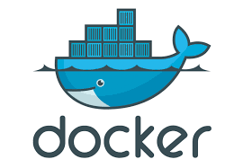

# Docker

Docker ist eine Software, die zur Containervirtualisierung verwendet wird. Mit Hilfe von Docker können wir einzelne Datenbanksysteme auf unseren Rechnern laufen lassen, ohne diese vollständig installieren zu müssen. Wenn ihr in den Labs mit euren eigenen Rechnern arbeiten möchtet, könnt ihr euch Docker natürlich bei euch lokal installieren. Alternativ stehen euch natürlich unsere Lab-Rechner zur Verfügung.



Wer Docker auf seinem/ihrem Privatrechnern installieren und einrichten will findet hierzu sehr viele Materialien online. Detaillierte Anleitung inkl. Systemvoraussetzungen (Achtung: bei Windows benötigt ihr Windows 10 Enterprise oder Education) usw. findet ihr hier:

* **Windows:** https://docs.docker.com/docker-for-windows/install/
* **Mac:** https://docs.docker.com/docker-for-mac/
* **Linux:** https://docs.docker.com/install/linux/docker-ce/ubuntu/

Weitere Tutorials und Tutorialvideos findet ihr natürlich online.

Passend zum DE-Kurs gibt es eine reihe von DBS Docker Images, die ihr auf euren Docker Instanzen laufen lassen könnt. Dazu könnt ihr nach erfolgreicher Docker-Installation folgende Befehle auf eurer Commandline/eurem Terminal ausführen:

```shell
docker pull mongo
docker pull redis
docker pull Cassandra
docker pull mariadb
docker pull neo4j
```

Anschließend kann mithilfe folgenden Befehls auf der Commandline/Terminal geprüft werden, ob auch alle Images gezogen werden konnten:

```shell
docker image ls
```

Um das jeweilige Image als COntainer zu deployen und laufen zu lassen könnt ihr anschließend folgenden Befehl eingeben:

```shell
docker run {image}
```