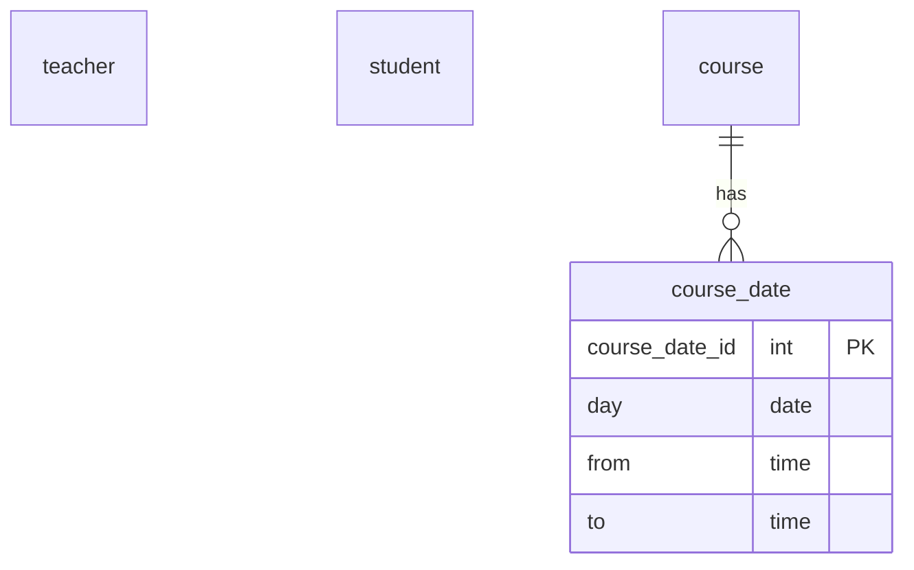

# MegaTutorium: Hogwarts Datenbank

Für Dokumentationszwecke soll für die Zaubereischule von Hogwarts eine Datenbank erstellt werden, in der alle Aspekte der magischen Welt erfasst werden können. In dieser Datenbasis sollen Schüler (inkl. ihrer Häuser), Lehrer, Unterrichtsfächer, Unerrichtszeiten und Zaubersprüche erfasst werden. Jedem Schüler können Fächer (unterschiedlicher Schwierigkeitsgrade und Klassenstufen) mit zuständigen Lehrern zugeordnet werden. Lehrer von Hogwarts sind in einer Hierarchie eingebettet – für die Analyse ist es wichtig zu wissen, welche Lehrer an welcher Stelle der Schulhierarchie stehen. Außerdem soll der Stundenplan der Schüler in der Datenbank gespeichert werden.

