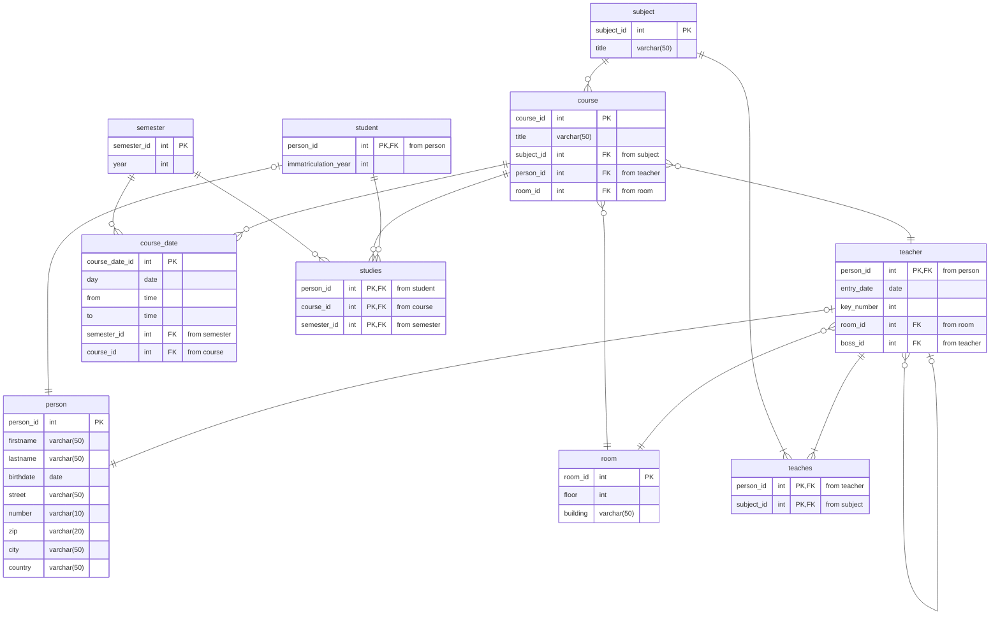

# MegaTutorium: Hogwarts Datenbank

Für Dokumentationszwecke soll für die Zaubereischule von Hogwarts eine Datenbank erstellt werden, in der alle Aspekte der magischen Welt erfasst werden können. In dieser Datenbasis sollen Schüler (inkl. ihrer Häuser), Lehrer, Unterrichtsfächer, Unerrichtszeiten, Räume und Zaubersprüche erfasst werden. Jedes Fach findet in Hogwarts immer im selben Raum statt. Außerdem ist der Stundenplan für jedes Semester fixiert - Fächer finden also während eines Semesters immer zur selben Zeit am selben Tag statt. Jedem Schüler können Fächer mit zuständigen Lehrern zugeordnet werden. Lehrer von Hogwarts sind in einer Hierarchie eingebettet – für die Analyse ist es wichtig zu wissen, welche Lehrer an welcher Stelle der Schulhierarchie stehen. Jeder Lehrer unterrichtet mehrere Fächer. Jedes Fach ist aber genau einem Lehrer zugeordnet. Diese Zuordnung kann sich aber über die Zeit hin ändern.

>**Note:** Im vorliegenden Modell wurden die Fremdschlüsselattribute in die Darstellung mitaufgenommen. Dies ist in der Crow's-Foot-Notation eigentlich nicht erforderlich. Die Darstellung wurde aber dennoch so gewählt, um Betrachtern das Nachvollziehen der Beziehungen - insbesondere der 1:1-Beziehungen - im Modell zu erleichtern.

