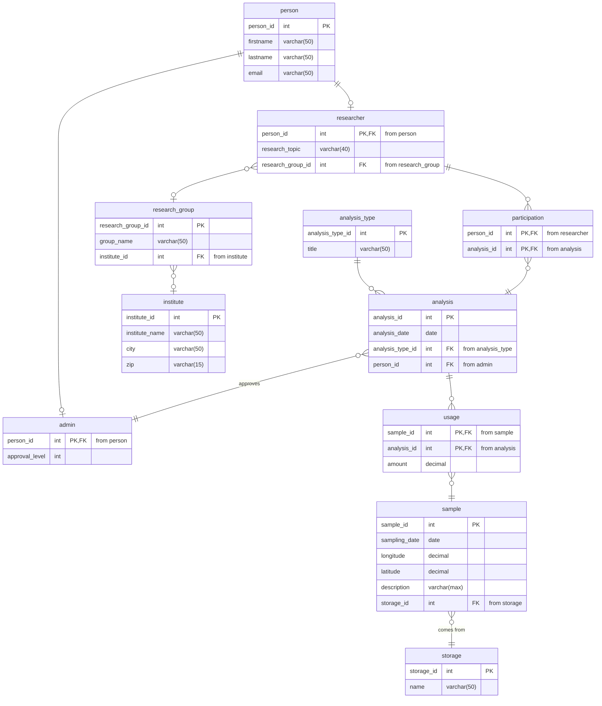

# MegaTutorium: Research Datenbank

Für die Erfassung von Wissenschaftlichen Proben in einem Forschungslabor solle ine Datenbank erstellt werden. Proben werden an einer bestimmten Stelle und zu einer bestimmten Zeit genommen und im System erfasst. Später können Sie mehrfach analysiert werden. Die Analyse erfolgt von unterschiedlichen Wissenschaftler:innen, die einer Forschungsinstitution und einer Forschungseinheit zugeordnet sind und von denen Name und Emailadresse erfasst werden soll. Die Analyse der Proben erfolgt mit Hilfe unterschiedlicher Analyseverfahren und wird ebenfalls protokolliert. Je nach Analyseverfahren ist die Freigabe durch unterschiedliche Personen des administrativen Personals erforderlich. Auch über für das administrative Personal sind Name und Emailadresse zu erfassen.

>**Note:** Im vorliegenden Modell wurden die Fremdschlüsselattribute in die Darstellung mitaufgenommen. Dies ist in der Crow's-Foot-Notation eigentlich nicht erforderlich. Die Darstellung wurde aber dennoch so gewählt, um Betrachtern das Nachvollziehen der Beziehungen - insbesondere der 1:1-Beziehungen - im Modell zu erleichtern.

