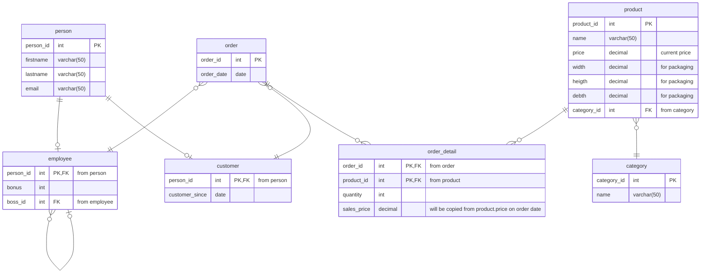

# MegaTutorium: Webshop Datenbank

Es soll eine Datenbank erstellt werden, in der Verkaufsvorgänge eines Handelsunternehmens abgebildet werden. In dieser Datenbasis sollen Verkaufsmitarbeiter:innen, Kund:innen und Bestellvorgänge erfasst werden. Jedem Bestellvorgang können Artikel (unterschiedlicher Kategorien und Stückzahlen) mit Verkaufspreisen sowie ein(e) zuständige Mitarbeiter:in zugeordnet werden. Mitarbeiter:innen des Unternehmens sind in einer Mitarbeiter:innen-Hierarchie eingebettet – für die Analyse ist es wichtig zu wissen, welche Mitarbeiter an welcher Stelle der Unternehmenshierarchie stehen. Einmal im Jahr erhalten die Verkaufsmitarbeiter:innen eine Erfolgsprämie. Die Höher dieser Prämie wird beim Einstellungsgespräch verhandelt und festgelegt und ändert sich dann nicht mehr.

>**Note:** Im vorliegenden Modell wurden die Fremdschlüsselattribute in die Darstellung mitaufgenommen. Dies ist in der Crow's-Foot-Notation eigentlich nicht erforderlich. Die Darstellung wurde aber dennoch so gewählt, um Betrachtern das Nachvollziehen der Beziehungen - insbesondere der 1:1-Beziehungen - im Modell zu erleichtern.

